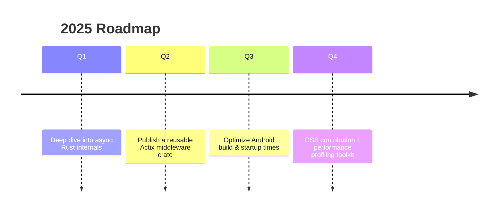

<!-- ============================================================
  PERSONAL BRAND HEADER
  Style: Bold, high-contrast gradient banner with concise tagline
=============================================================== -->
<p align="center">
  
</p>

<!-- QUICK ID / SOCIAL -->
<p align="center">
  <a href="mailto:your.email@example.com">
    
  </a>
  <a href="https://linkedin.com/in/your-linkedin-username">
    
  </a>
  <a href="https://twitter.com/your-twitter-username">
    
  </a>
  <a href="https://stackoverflow.com/users/your-so-id">
    
  </a>
</p>

<p align="center">
  
</p>

---

### 👋 Hi, I’m Sourav

I engineer performant backend services (Rust / Actix Web), craft scalable Android and Kotlin-based mobile layers, and enjoy squeezing unnecessary latency and allocation out of critical paths. I’m driven by clarity, correctness, and code longevity.

- 🔭 Current Focus: Building robust APIs & exploring deeper systems-level patterns in Rust.
- 📱 Mobile: Kotlin + clean architecture (layers, DI, coroutines).
- 🚀 Goal (Next 12 Months): Contribute to an OSS Rust crate or JVM performance tool.
- 💬 Ask Me About: Async Rust, Kotlin coroutines design, API ergonomics, safe performance refactors.
- 🧪 Philosophy: Fewer features done well > many partially baked ones.
- ⚡ Motto: “Make the default path the safe & fast one.”

---

### 🧠 Engineering Principles (My Edge)

| Principle | Why It Matters | How I Apply It |
|-----------|----------------|----------------|
| Determinism | Reduces debugging chaos | Avoid hidden global state, explicit error surfaces |
| Mechanical Sympathy | Hardware-aware decisions | Benchmark & profile before “optimizing” |
| Intentional Concurrency | Avoids complexity walls | Prefer structured concurrency & explicit ownership |
| Safety with Speed | Sustainable performance | Rust for core services; Kotlin for product velocity |
| Observability Early | Faster iteration loops | Logs + metrics scaffolding before scaling logic |

---

### 🛠 Core Tech Stack

<p align="center">
  <!-- Main Languages -->
  
  
  
  
  
  
  <!-- Frameworks / Tools -->
  
  
  
</p>

<details>
<summary><strong>🧩 Supporting Tools & Interests (toggle)</strong></summary>

- Build / Packaging: Gradle, Cargo
- Testing: JUnit, cargo test, instrumentation (Android)
- Concurrency: coroutines, async/await, thread pools
- Profiling: (Add: Android profiler, cargo-flamegraph, async instrumentation)
- (Optionally add Docker / Cloud if you use them)
- Potential Add: CI (GitHub Actions), metrics dashboards
</details>

---

### 📌 Featured Work (Update With Your Repos)

<p align="center">
  <a href="https://github.com/souravk29/rust-actix-starter">
    
  </a>
  <a href="https://github.com/souravk29/kotlin-android-template">
    
  </a>
</p>

> Tip: Rename or create repos that reflect real strengths (e.g., `actix-performance-lab`, `android-clean-architecture-demo`).

---

### 📊 Metrics & Analytics

<div align="center">
  <picture>
    <source 
      srcset="https://github-readme-stats.vercel.app/api?username=souravk29&show_icons=true&theme=tokyonight&include_all_commits=true&count_private=true&hide_border=true"
      media="(prefers-color-scheme: dark)"
    />
    
  </picture>
  <picture>
    <source 
      srcset="https://github-readme-stats.vercel.app/api/top-langs/?username=souravk29&layout=compact&langs_count=8&theme=tokyonight&hide_border=true"
      media="(prefers-color-scheme: dark)"
    />
    
  </picture>
  <br/>
  
  <br/>
  
</div>

> NOTE: "Top Languages" ≠ skill level. It’s a public repo size ratio.

---

### 🏆 Achievements

<p align="center">
  
</p>

---

### 🐍 Contribution Visual

<p align="center">
  
</p>

<details>
<summary><strong>Enable Snake Animation (steps)</strong></summary>

1. Create: `.github/workflows/snake.yml`  
2. Use action: `Platane/snk@v3`  
3. Output to branch: `output`  
4. Commit & ensure the SVG path matches above.
</details>

---

### 🧭 Learning Trajectory



(Adjust timeline as goals evolve.)

---

### 🧪 Sample Philosophy (Rust API Snippet)

```rust
/// Example pattern: explicit error types + small surface
pub async fn create_user(
    payload: web::Json<NewUser>,
    repo: web::Data<UserRepo>
) -> Result<impl Responder, ApiError> {
    let user = repo.create(&payload.into_inner()).await?;
    Ok(web::Json(UserDto::from(user)))
}
```

> Favor explicit domain errors over generic boxed ones for debuggability & quality of logs.

---

### 📝 (Optional) Latest Articles

<!-- BLOG-POST-LIST:START -->
<!-- BLOG-POST-LIST:END -->

<details>
<summary><strong>Enable Auto Blog Updates (instructions)</strong></summary>

1. Add workflow: `gautamkrishnar/blog-post-workflow`  
2. Provide your RSS feed (Dev.to, Medium, Hashnode).  
3. It overwrites the comment block above.
</details>

---

### ⏱️ (Optional) WakaTime Stats

<!--

-->

<details>
<summary><strong>Enable WakaTime (instructions)</strong></summary>

1. Create WakaTime account, get API key  
2. Add secret: `WAKATIME_API_KEY`  
3. Use action: `athul/waka-readme`  
4. Add placeholder comments if needed.
</details>

---

### 📦 (Optional) All-in-One Metrics

After configuring:
```

```

<details>
<summary><strong>Enable Metrics Card (lowlighter/metrics)</strong></summary>

1. Generate a classic token with `public_repo` (and extra scopes if needed).  
2. Add secret: `METRICS_TOKEN`  
3. Use workflow from repo: `lowlighter/metrics`.  
4. Choose plugins: languages, activity, achievements, lines, habits, etc.
</details>

---

### 🤝 Collaboration

Got an idea around performance benchmarking, reliable async APIs, or mobile-backend sync flows?  
→ Reach out: your.email@example.com

---

### ✅ Setup Checklist (Delete Once Done)

- [ ] Replace email + social usernames
- [ ] Replace pinned repos + create any missing ones
- [ ] Add snake workflow
- [ ] Optional: Add blog + WakaTime + metrics workflows
- [ ] Remove checklist + internal comments

---

<p align="center">
  
</p>

<p align="center">
  
</p>

<!--
This README is intentionally modular. Trim sections that don't serve your narrative.
-->
