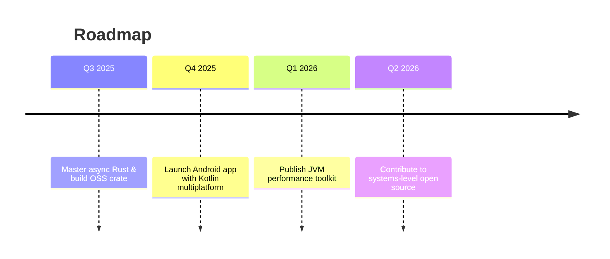

<!-- ============================================================
  OUTSTANDING PERSONAL BRAND HEADER
=============================================================== -->

  

  
  
  
  

  

---

<h2 align="center">Hi, I'm Sourav 👋</h2>

  <b>Systems & Backend Specialist | Android Enthusiast | Code Artist</b>

  

---

### 🏆 My Philosophy

> "Elegant code is simple, predictable, and scalable.  
> The best solutions are the ones you'll understand in a year."

---

### 🚀 Tech Toolbox

  
  
  
  
  
  
  
  
  

---

### 🌏 About Me

- 🔭 Building scalable APIs & mobile apps for a better user experience.
- 🧑‍💻 Currently obsessed with Rust async, Actix Web, and modern Android architecture.
- 🎯 On a journey to make code safer, faster, and more maintainable.
- 💬 Always happy to discuss: Rust internals, Kotlin coroutines, JVM tuning, Android UX patterns.
- 🌱 I love open-source and learning new paradigms.

---

<strong>📌 Featured Projects</strong> (Click to expand)

  
  

---

### 📊 GitHub Stats & Activity

  
  
   
  
   
  

---

### 🏅 Achievements

  

---

### 🐍 Contribution Animation

  

<strong>Enable Snake Animation (instructions)</strong>

1. Create: `.github/workflows/snake.yml`  
2. Use action: `Platane/snk@v3`  
3. Output to branch: `output`  
4. Commit & ensure the SVG path matches above.

---

<strong>📝 Latest Articles & Blog Posts</strong> (Auto-updates with workflow)

<!-- BLOG-POST-LIST:START -->
<!-- BLOG-POST-LIST:END -->

---

<strong>⏱️ WakaTime Coding Stats (Optional)</strong> (Enable with workflow)

<!--

-->

---

<strong>🧭 Learning Trajectory & Roadmap</strong> (Click to expand)

---

### 🤝 Let's Collaborate

Got an idea about systems, performance, or mobile UX?  
**Reach out:** your.email@example.com

---

  

<!--
This README is modular, professional, and dynamic.
Remove guidance/checklist sections after setup.
Customize as your journey evolves!
-->
